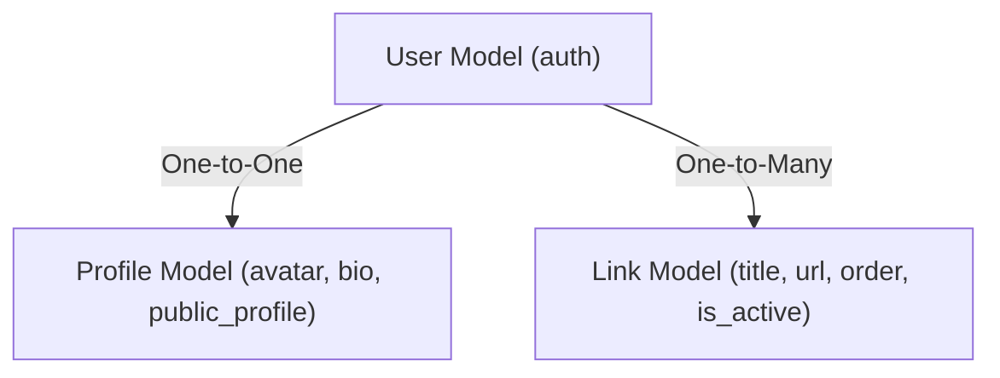

# Pagify: Sleek Micro-Landing Page Builder

Pagify is a premium full-stack micro-landing page application designed for content creators, artists, and developers who need a single, elegant link to house their entire digital world. Built using a decoupled architecture with **Django (Django REST Framework)** on the backend and **Next.js** on the frontend, it demonstrates how to handle custom relational APIs, dynamic URL routing, and seamless frontend state updates out of the box.

---

## 🚀 The Core Experience

Imagine having one beautiful link that represents your entire online persona. With Pagify:
* **Creator Dashboard:** Authenticated creators can view, add, and delete links dynamically on a protected dashboard.
* **Boilerplate Integration:** Reuses the starter kit's built-in `Profile` system to display creator bios, avatar pictures, and respect global user settings (like toggling a profile between public and private).
* **Next.js Dynamic Routing:** Anyone can visit `http://localhost:3000/[username]` to see a creator's public micro-landing page immediately, rendered dynamically.
* **Custom REST APIs:** Pure custom-built DRF views ensure exact queries, clean error states (like returning a proper 404 if a user profile doesn't exist), and secure permission boundaries.

---

## 🛠️ Architecture & Relationship Flow

To keep the application highly scalable and clean, Pagify adopts a robust relational database structure. Instead of duplicating profile information, Pagify relies on a flat, interconnected design:

* **Identity Layer:** Supported by the boilerplate's pre-built `User` and `Profile` models (accessible as `user.profile`), managing the creator's username, biography, and avatar.
* **Content Layer:** Controlled by our custom `Link` model, which establishes a many-to-one relationship back to the `User`.



Whenever a dynamic frontend route (like `/[username]`) is hit:
1. The frontend extracts the username from the URL dynamic path.
2. The backend validates the username, grabs their biography/avatar details, and pulls all their active links sorted by order.
3. The frontend displays the page in a clean, mobile-first design using Tailwind CSS.

---

## 🛠️ Tech Stack

| Layer | Technology | Key Usage |
|---|---|---|
| **Backend** | Django & DRF | API handling, explicit SQL/ORM queries, custom REST view routing |
| **Frontend** | Next.js & React | Dynamic routing, custom pages, responsive rendering |
| **Styling** | Tailwind CSS | Sleek premium light/dark components, mobile-first cards |
| **Database** | SQLite | Local relational storage, structured tables |
| **State** | React Context & Hooks | Local client-side tracking, forms validation |

---

## 📁 Key Directories

```bash
pagify/
├── backend/                # Django REST API Backend
│   ├── links/             # Custom Django app for Pagify links
│   │   ├── models.py      # New Link model
│   │   ├── views.py       # Custom REST APIViews
│   │   ├── serializers.py # Explicit serializers
│   │   └── urls.py        # API endpoints
│   └── userauths/         # Pre-built Authentication & Profiles
└── frontend/               # Next.js Frontend
    └── app/
        ├── dashboard/
        │   └── links/     # Secured Link Management dashboard page
        └── [username]/    # Dynamic Public Profile router page
```

---

## 🎯 Developer Implementation Roadmap

The project is structured into three highly focused phases, following a strict **Vertical Slicing** methodology:

### Phase 1: The Foundation
* **Initialize Stack:** Get the boilerplate servers connected and verified.
* **Create Links App:** Design and migrate the custom `Link` model, register it in the Django Admin portal, and seed it with dummy links from the Python interactive shell.
* **Create Dashboard API:** Build the GET view to retrieve links for the currently authenticated developer.
* **Create Frontend List:** Render a styled grid of links in the creator's dashboard, displaying loading screens and empty states.

### Phase 2: Link Management
* **Build Create Endpoint:** Implement a POST view to accept, validate, and create links.
* **Next.js Creation:** Add an interactive modal/inline form to add links and optimistically append them to the UI list without a page refresh.
* **Build Delete Endpoint:** Set up a secure DELETE view validating ownership.
* **Next.js Deletion:** Wire up trash buttons to remove link items instantly from the viewport.

### Phase 3: The Public Profile
* **Build Public API:** Build the `/api/profile/<str:username>/` public endpoint that returns user identity metadata and active links or a 404 if not found.
* **Dynamic Next.js Route:** Implement the `/[username]/page.tsx` dynamic folder route.
* **Assemble Public Landing Page:** Fetch from the public endpoint and layout a beautiful, centered, premium mobile-first landing page.

---

## 🚦 Getting Started

### 1. Run the Backend (Django)
```bash
cd backend
python -m venv venv
# Activate virtual environment
venv\Scripts\activate      # Windows
source venv/bin/activate   # macOS/Linux

# Install packages & run migrations
pip install -r requirements.txt
python manage.py migrate

# Boot Django server
python manage.py runserver
```

### 2. Run the Frontend (Next.js)
```bash
cd frontend
npm install
npm run dev
```

Open `http://localhost:3000` to start building!
